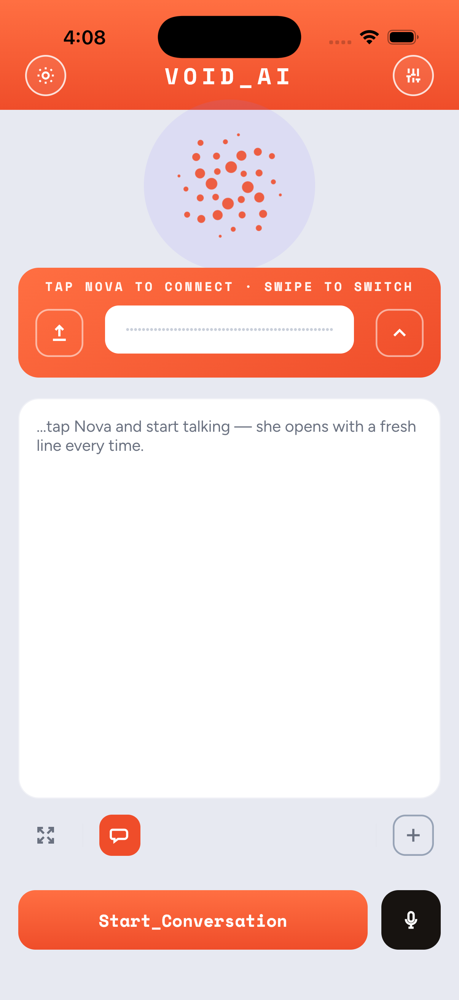
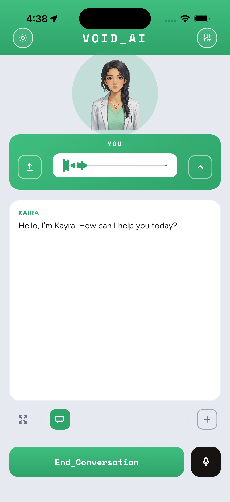

# VOID_AI — a multi-persona, voice-first AI agent

A real-time **voice agent with a screen**, for iOS / Android / desktop. You talk, it talks back
(sub-second, full-duplex), and it drives a dynamic view surface — maps, web, images, shopping —
with its own tools. Swipe the agent icon to switch between two personas:

- **Nova** — a razor-sharp, dry-witted personal assistant (find places, look things up, shop, navigate).
- **Kaira** *(“kay-ruh”)* — a calm, friendly GP-style health assistant that runs a proper clinical
  intake (chief complaint → history → a preliminary triage assessment to hand to a real doctor),
  and can look up nearby clinics + directions.

<table>
  <tr>
    <td align="center"><b>Nova</b> — sassy assistant</td>
    <td align="center"><b>Kaira</b> — GP health assistant</td>
  </tr>
  <tr>
    <td></td>
    <td></td>
  </tr>
</table>

Swiping the agent icon switches persona — the app recolors (coral ⇄ medical green), the avatar
changes (galaxy orb ⇄ animated doctor), and it reconnects to that persona’s backend.

---

## How it fits together

```
┌─────────────────────────────┐        WebRTC (audio + a data channel)        ┌──────────────────────────┐
│  App  (kaira-slint)          │  ───────────────────────────────────────────▶ │  Bot  (pipecat-agent)     │
│  Rust + Slint                │                                                │  Pipecat, Python          │
│  iOS · Android · desktop     │  ◀─────────────────────────────────────────── │  Gemini Live (S2S) + tools │
│  renders the view surface    │      server-messages drive the UI (map/web/…)  │  Nova :8080 · Kaira :8081  │
└─────────────────────────────┘                                                └──────────────────────────┘
```

- **App** (`kaira-slint/`) — native Rust + [Slint](https://slint.dev) UI. The agent icon, the
  view surface (chat / map / web / images / shopping), persona switching, and the WebRTC client.
- **Bot** (`pipecat-agent/`) — a [Pipecat](https://pipecat.ai) pipeline. Full-duplex
  speech-to-speech via **Gemini Live**, plus a tool layer (place search via Google Maps, web,
  images, shopping, directions, clinic lookup). Personas live in `personas.py`.
- **Deploy** (`pipecat-agent/deploy/`) — runs the bots on a DigitalOcean droplet (public IP →
  self-hosted WebRTC, no TURN needed). One instance per persona.

> The other top-level folders (`compare/`, `model-test/`, `soniox-*`, `pipecat-bench/`, `voicelab/`,
> `VOID_ai/`) are experiments and on-device STT/TTS benchmarks from the R&D that led here.

---

## Running it

### 1. API keys
Copy the example and fill in your own keys (never commit real keys — `.env*` is gitignored):

```bash
cp pipecat-agent/.env.example pipecat-agent/.env   # then edit
```
Needed: `GEMINI_API_KEY` (Gemini Live). For the tools: `MAPBOX_TOKEN`, `SERPAPI_API_KEY`
(Google Maps place/clinic search + shopping), `TAVILY_API_KEY` (web/images). Cascade mode also
uses `SONIOX_API_KEY` + `OPENROUTER_API_KEY`.

### 2. The bot (backend)
```bash
cd pipecat-agent
uv sync
KAIRA_MODE=gemini uv run bot.py            # → browser test client at http://localhost:7860
```
- `KAIRA_MODE` — `gemini` (full-duplex S2S, default for this build) or `cascade` (Soniox+Gemma+Soniox).
- `KAIRA_PERSONA` — `nova` (default) or `kaira`.
- To serve **both** personas locally, run two instances on different ports:
  ```bash
  KAIRA_MODE=gemini KAIRA_PERSONA=nova  uv run bot.py --host 0.0.0.0 --port 7860
  KAIRA_MODE=gemini KAIRA_PERSONA=kaira uv run bot.py --host 0.0.0.0 --port 7861
  ```
- Deploy to a public host: see [`pipecat-agent/deploy/README.md`](pipecat-agent/deploy/README.md).

### 3. The app (client)
```bash
cd kaira-slint
cargo run                                   # desktop (fast UI iteration; realtime is mobile-only)
```
- **iOS:** open `KairaSlint.xcodeproj` in Xcode (device or simulator), or drive `xcodebuild -sdk
  iphonesimulator … -derivedDataPath build_sim`. The app points at the backend via
  `src/lib.rs` `DEFAULT_BOT` (per-persona ports), overridable at runtime with a
  `realtime_url*.txt` file in the app’s files dir.
- **Android:** `cargo apk` + `./deploy.sh` (see [`kaira-slint/README.md`](kaira-slint/README.md)).

> **Sharing note:** the app defaults to a demo backend IP with **no auth** — anyone with the app
> can use those bots (and the keys behind them). To share widely, run **your own** backend and
> point the app at it, or add auth first (see `openspec/changes/secure-bot-endpoint`).

---

## Project docs
- [`kaira-slint/README.md`](kaira-slint/README.md) — the app (build, Android deploy, gotchas).
- [`pipecat-agent/README.md`](pipecat-agent/README.md) — the bot (pipeline, run).
- [`pipecat-agent/deploy/README.md`](pipecat-agent/deploy/README.md) — droplet deploy.
- [`openspec/`](openspec/) — spec-driven change proposals (features + design notes).
- [`CLAUDE.md`](CLAUDE.md) — orientation for AI coding agents working in this repo.

Built with Rust + Slint, Pipecat, and Gemini Live.
